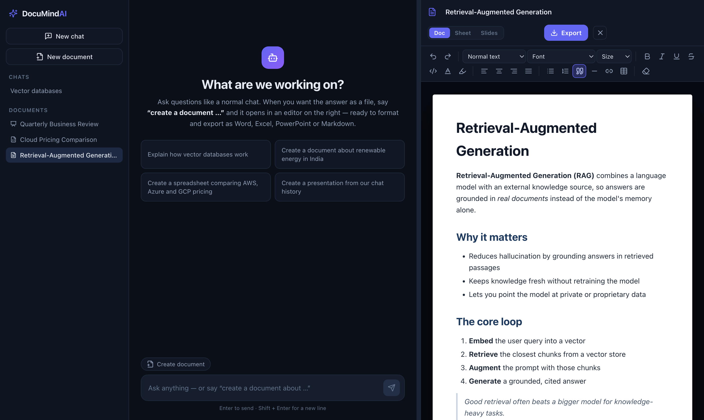
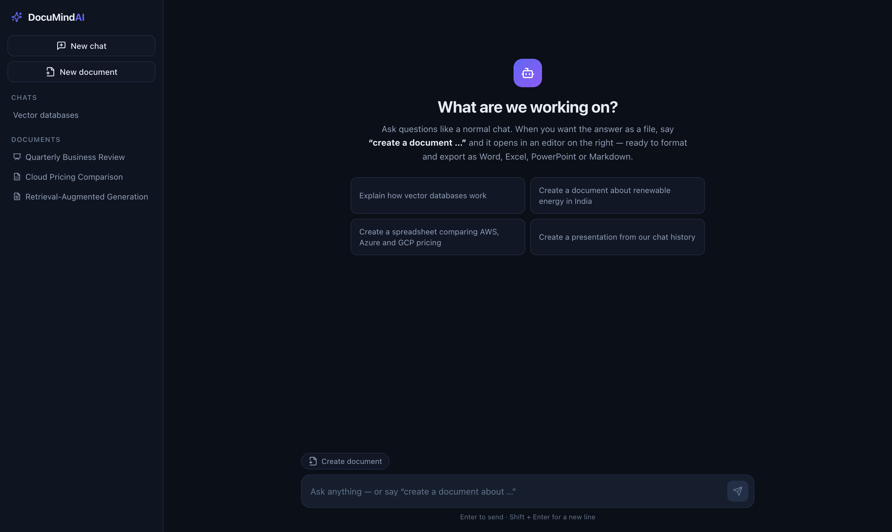
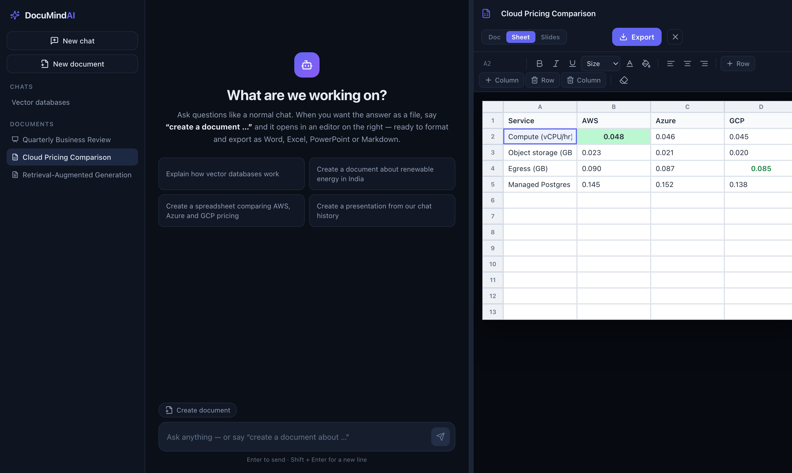
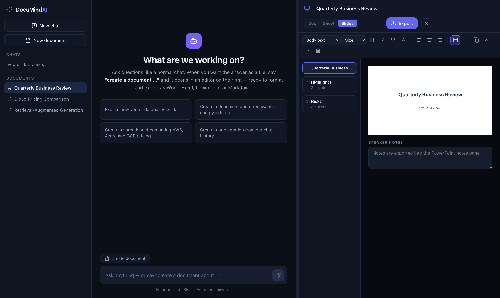
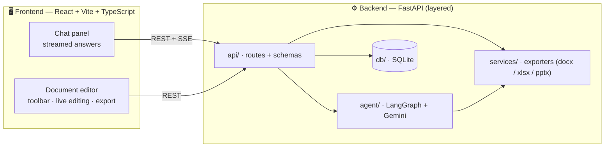
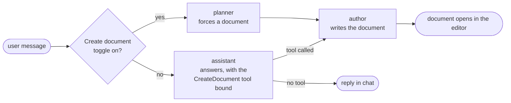

<div align="center">

# 📝 DocuMind AI

### Chat with AI, then turn any answer into an editable, exportable document.

Ask a question like a normal chatbot. Say **“create a document about X”** — or **“create a document from our chat history”** — and DocuMind writes the whole thing and opens it in a live editor beside the conversation: a **Word-style page**, a **spreadsheet**, or a **slide deck**, with a real formatting toolbar and one-click export to `.docx`, `.xlsx`, `.pptx`, `.md`, `.csv`, `.html` and `.txt`.

<br/>


<br/>



</div>

---

## ✨ What it does

DocuMind is a two-panel workspace. On the **left** you chat with Google Gemini. The moment you ask for a document, a **LangGraph** branch takes over, writes the full content, saves it, and streams it into an **editor on the right** — the kind of in-app document editor you'd expect from Word, Excel or PowerPoint, right next to the conversation.

- 💬 **Real chat** — streamed, markdown-rendered answers with conversation history.
- 🧠 **The AI decides the format** — Gemini picks a document, a spreadsheet or a deck based on what you asked, using a tool call.
- 📄 **From a topic or from the chat** — “create a document about renewable energy” *or* “create a document from our chat history”.
- ✍️ **Edit like an office app** — bold, italic, underline, font family, font **size** (in points), text colour, highlight, alignment, headings, lists, tables, slides, cell styling — all in the browser.
- 📤 **Export anywhere** — download `.docx`, `.xlsx`, `.pptx`, `.md`, `.csv`, `.html` or `.txt`. Formatting you applied in the browser carries into the file.
- 💾 **Autosaves** as you type, and always before an export.

---

## 📸 Screenshots

|  |  |
|---|---|
| **Ask anything, or ask for a document** | **Word-style rich text editor** |
|  |  |
| **Spreadsheet with per-cell styling** | **Slide deck with thumbnails & notes** |
|  |  |

---

## 🧩 How it works

The frontend and backend are **separate layers** — the React app never imports backend code and talks to it only over HTTP (REST + Server-Sent Events).



### The agent decides whether to write a document



- **assistant** answers normally, with a `CreateDocument` tool available. Gemini calls it when you ask for a document, choosing `doc`, `sheet` or `slides` itself.
- **planner** is used only when you flip the *Create document* toggle in the composer — it forces a document, letting the model still choose the title and format.
- **author** writes the content with a format-specific prompt and streams the markdown into the editor as it’s produced.

Conversation history lives in the database and is replayed into the graph each turn, so **“create a document from our chat history”** works from the real transcript.

---

## 📦 Document types & exports

Markdown is the canonical content. When a document is created, the backend derives the editor’s state from it.

| Type | Editor | Exports |
|------|--------|---------|
| 📄 **Doc** | Rich-text page (TipTap) — headings, lists, tables, quotes, code, links, images | `.docx` · `.md` · `.html` · `.txt` · `.pptx` |
| 📊 **Sheet** | Spreadsheet grid — range selection, per-cell bold/italic/colour/fill/alignment | `.xlsx` · `.csv` · `.md` · `.docx` |
| 📽️ **Slides** | 16:9 slide canvas + thumbnail strip + speaker notes | `.pptx` · `.md` · `.docx` |

The **Doc / Sheet / Slides** switch in the editor header converts a document between formats — markdown is the bridge, and the backend rebuilds the editor payload.

Formatting carried into exports: **bold, italic, underline, strikethrough, font family, font size (points, 1:1 with Word), text colour, highlight/fill, alignment, headings, nested bullet & numbered lists, quotes, code blocks, tables, links, inline images, per-cell spreadsheet styles, and per-slide title/body styling + speaker notes.**

---

## 🚀 Quick start

**Prerequisites:** Python 3.11+, Node 18+, and a free Gemini API key from [Google AI Studio](https://aistudio.google.com/apikey).

### 1 · Backend

```bash
cd backend
python3 -m venv .venv
./.venv/bin/pip install -r requirements.txt
cp .env.example .env          # then put your real key in GOOGLE_API_KEY
./.venv/bin/uvicorn app.main:app --reload --port 8000
```

API docs at <http://localhost:8000/docs> · health at <http://localhost:8000/api/health>
(`gemini_key_configured` tells you whether the key was picked up).

### 2 · Frontend

```bash
cd frontend
npm install
npm run dev
```

Open <http://localhost:5173>. The Vite dev server proxies `/api` to `http://localhost:8000`, so there’s nothing else to configure.

### …or run both at once

```bash
./scripts/dev.sh
```

> **Note:** On Gemini’s free tier (20 requests/min) a long document can occasionally hit a rate limit — the app retries automatically and keeps any partial draft. If it happens, wait a moment, or set `GEMINI_MODEL=gemini-2.5-flash-lite` in `backend/.env`.

---

## 💡 Try it

Once both servers are up, type any of these:

```
Explain how vector databases work
Create a document about renewable energy in India
Create a spreadsheet comparing AWS, Azure and GCP pricing
Create a presentation from our chat history
```

The first is answered in chat. The rest open an editor on the right — edit, format, and hit **Export**.

---

## 🛠️ Tech stack

| Layer | Stack |
|-------|-------|
| **Frontend** | React 18 · TypeScript · Vite · Zustand · [TipTap](https://tiptap.dev) (rich text) · custom spreadsheet & slide editors · `marked` / `turndown` for markdown ↔ HTML |
| **Backend** | FastAPI · [LangGraph](https://langchain-ai.github.io/langgraph/) · `langchain-google-genai` (Gemini) · SQLAlchemy (async) + SQLite |
| **Exporters** | `python-docx` · `openpyxl` · `python-pptx` — HTML/grid/deck → Office files |
| **Transport** | REST + Server-Sent Events for token streaming |

---

## 🗂️ Project structure

```
Claude UI/
├── backend/                     FastAPI + LangGraph + Gemini  (port 8000)
│   └── app/
│       ├── main.py              app, CORS, error handling
│       ├── core/                settings, domain errors
│       ├── api/routes/          health · conversations · chat · documents
│       ├── agent/               graph · prompts · tools · Gemini client · state
│       ├── services/            chat orchestration · conversations · documents
│       │   ├── export/          docx / xlsx / pptx renderers + dispatcher
│       │   └── markdown_tools   markdown ↔ grid / deck / html
│       ├── db/                  async session + ORM models
│       └── schemas/             request/response models
├── frontend/                    React + Vite + TypeScript      (port 5173)
│   └── src/
│       ├── api/                 typed client + SSE reader
│       ├── store/               zustand store
│       ├── components/chat/     chat panel · messages · composer
│       ├── components/editor/   document panel · 3 editors · toolbars · export
│       ├── lib/                 markdown conversion · font-size extension · constants
│       └── styles/              theme + editor styles
├── scripts/dev.sh               run backend + frontend together
└── docs/images/                 screenshots
```

---

## 🔌 API

| Method | Path | Purpose |
|--------|------|---------|
| `GET` | `/api/health` | status + whether the Gemini key is set |
| `POST` | `/api/chat/stream` | chat turn, streamed as SSE |
| `GET` `POST` | `/api/conversations` | list / create chats |
| `GET` `PATCH` `DELETE` | `/api/conversations/{id}` | fetch (with messages) / rename / delete |
| `GET` | `/api/conversations/{id}/documents` | documents from a chat |
| `GET` `POST` | `/api/documents` | list recent / create blank |
| `GET` | `/api/documents/formats` | export formats per document type |
| `GET` `PATCH` `DELETE` | `/api/documents/{id}` | fetch / autosave + convert type / delete |
| `POST` | `/api/documents/{id}/export` | save live editor state and download |

<details>
<summary><b>SSE events on <code>/api/chat/stream</code></b></summary>

| Event | Payload | Meaning |
|-------|---------|---------|
| `start` | `{conversation_id, message}` | user turn stored |
| `token` | `{text}` | chat answer delta |
| `doc_start` | `{doc_type, title}` | the author node took over |
| `doc_token` | `{text}` | document markdown delta |
| `document` | `{document}` | finished, persisted document |
| `message` | `{message}` | finished assistant turn |
| `title` | `{conversation_id, title}` | chat auto-named |
| `error` | `{message}` | failure (stream still closes cleanly) |
| `done` | `{}` | end of stream |

</details>

---

## ⚙️ Configuration

`backend/.env`:

| Variable | Default | Notes |
|----------|---------|-------|
| `GOOGLE_API_KEY` | — | **required** |
| `GEMINI_MODEL` | `gemini-3.7-flash` | any Gemini chat model |
| `GEMINI_TEMPERATURE` | `0.4` | |
| `GEMINI_MAX_OUTPUT_TOKENS` | `8192` | raise for longer documents |
| `HISTORY_WINDOW` | `24` | messages replayed to the model |
| `DATABASE_URL` | SQLite | any SQLAlchemy async URL |
| `CORS_ORIGINS` | localhost dev ports | comma separated |

Frontend: set `VITE_API_BASE` to point at a backend on another host (defaults to the dev proxy at `/api`).

---

## 📝 Notes

- SQLite tables are created on boot — no migration step.
- Deep links: open the app with `?doc=<id>` to jump straight to a document, or `?chat=<id>` to restore a conversation.
- Without a valid `GOOGLE_API_KEY` the app still runs — chat returns a clear error, and the editors and exports work on their own.
